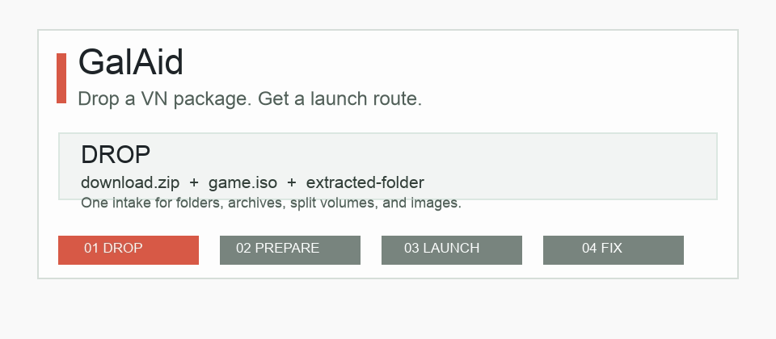

# GalAid

[English](README.md) / [简体中文](README.zh-CN.md) / 日本語

GalAid は、ビジュアルノベル / galgame フォルダ向けのローカル優先の起動診断ツールです。

目的はシンプルです。ゲームを入手したあと、「どのファイルを起動すればいいのか」「なぜ起動しないのか」を判断しやすくします。

- VN フォルダ、アーカイブ、ディスクイメージのファイル一覧を投入
- 起動候補、エンジン/ファイル構造の手がかり、実行環境チェック、次の手順を表示
- ゲームファイルを含まないメタデータのみのサポートバンドルを出力
- 静的 Web アプリ、GitHub Pages デモ、ローカルデスクトップ beta として利用可能

デモ：`https://TonyNa-code.github.io/GalAid/`



## なぜ必要か

多くの VN プレイヤーは、ゲームを起動する前の段階で詰まります。

- アーカイブが完全に展開されていない
- `.iso`、`.cue/.bin`、`.mds/.mdf` などの扱いが分からない
- 日本語ロケール、フォント、パス文字化けで起動に失敗する
- 古い DirectX、VC++ Runtime、RPG Maker RTP が不足している
- フォルダ内に複数の `.exe` があり、主プログラムが分からない

GalAid はこれらを小さな診断レポートと手順に整理します。

## 主な機能

- 起動候補の検出：`.exe`、`.bat`、`.cmd`、`.lnk`、`index.html`
- 初心者向けの次の手順ロードマップ
- 起動プロファイルと Windows コマンドのヒント
- インストーラ、アンインストーラ、パッチ、ランタイム同梱ツールを主プログラムと区別
- 分割アーカイブやディスクイメージの検出：`.part1.rar`、`.7z.001`、`.iso`、`.cue/.bin`
- 古いイメージ形式や媒体セットの検出：`.mds/.mdf`、`.ccd/.img/.sub`、`.nrg`、BlindWrite、`.mdx`、`.daa`、`.uif`、`.pdi`
- 起動画面の一括フロー：投入、準備、推奨起動、失敗時の画像/エラー追加、相談文コピー
- KiriKiri、NScripter、Siglus、RPG Maker、Unity、TyranoScript、商用/自社エンジン構造の手がかりを検出
- 商用/自社 VN に多い構造を主要ルートとして診断：ルート exe、同階層 DLL、大きなリソースアーカイブ、設定ファイル、作業フォルダ
- 貼り付けたエラー文をローカルのエラーレシピに照合
- エラー画像 OCR で、スクリーンショット内の文字をエラー診断へ追加
- 起動失敗後のクイック問診：何が見えたか、どこから起動したか、エラーをコピーできるかを記録し、手順、レポート、サポートバンドルへ反映
- 20,000+ ファイルの大規模フォルダ向けモード
- デスクトップ beta でネイティブフォルダ選択と再帰スキャン
- デスクトップのパッケージ/イメージ事前チェックは ZIP ディレクトリ、同梱またはローカル 7z ツールによる RAR/7z メタデータ、ディスクイメージ種別を扱い、ユーザー確認後にローカル展開、ISO マウント/イメージ展開、再スキャンもできる
- Markdown 診断レポートのコピー/ダウンロード
- 手順、環境チェック、レシピ一致、ファイル一覧概要をまとめたサポートバンドルの出力

## 診断言語

現在の画面 UI は主に中国語ですが、診断出力は 中文、English、日本語から選択できます。対象は次の出力です。

- コピーされるレポート
- ダウンロードされるレポート
- 手順チェックリスト
- サポートバンドルの README とサポート概要

リポジトリの既定 README は、国際的な OSS 利用者向けに English のままです。

## 大きなゲームと 10GB アーカイブ

Web 版はファイル名、相対パス、拡張子、サイズだけを読むため、10GB 級の展開済みゲームフォルダでも通常は問題ありません。主な制約は容量ではなくファイル数です。

- 20,000 ファイル未満：通常のメタデータスキャン
- 20,000+ ファイル：大規模フォルダモード
- 50,000+ ファイル：応答性を保つため完全なパスソートを省略

単体の `.zip/.rar/.7z/.iso/.cue/.bin` は Web 版でもパッケージ段階として識別できます。`.mds/.mdf`、`.ccd/.img/.sub`、`.nrg`、BlindWrite、`.mdx`、`.daa`、`.uif`、`.pdi` などの古いディスクイメージも扱います。デスクトップ beta は ZIP ディレクトリメタデータを確認し、同梱またはローカル 7z ツールで RAR/7z のディレクトリメタデータも一覧化できます。またインストールディスク、修正パッチ、特典ディスク、分割ファイル、ディスクイメージ種別も判定します。ユーザーが「展開して再スキャン」または「マウント/展開して再スキャン」を押した場合は、出力先を選び、既に知っているパスワードを入力し、ローカル展開、Windows ISO マウント、または一般的なイメージの展開後に自動で再スキャンできます。準備完了後は起動画面で推奨入口を強調し、ユーザーがファイル一覧を探し直さなくて済むようにします。起動に失敗した場合は、見えた症状を選ぶだけで手順を更新できます。

## エラー画像 OCR

起動エラーのダイアログは文字をコピーできないことがあります。GalAid はエラー画像を選択し、認識した日本語/英語/中国語テキストをエラー欄へ追加して、同じレシピ診断へ渡せます。

デスクトップ beta は Tesseract.js を使います。初回 OCR では言語データをアプリのキャッシュへ取得する場合があります。Web 版はブラウザの文字検出を優先し、必要に応じてページ内 OCR エンジンを読み込みます。

## ローカル実行

直接開く：

```text
index.html
```

またはローカルサーバーで実行：

```bash
python3 -m http.server 4173
```

デスクトップ beta：

```bash
npm install
npm start
```

## コントリビュート

エラーレシピ、商用/自社エンジン構造の例、エンジン指紋、ドキュメント、誤判定例の改善を歓迎します。[docs/CONTRIBUTING.md](docs/CONTRIBUTING.md) と [docs/GOOD_FIRST_ISSUES.md](docs/GOOD_FIRST_ISSUES.md) から始めてください。

送信前に実行してください。

```bash
npm run check
npm run test:smoke
```

## ライセンス

MIT. See [LICENSE](LICENSE).
