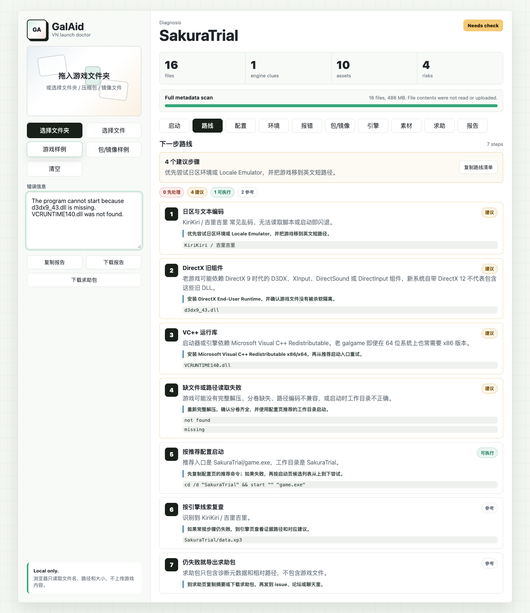

# GalAid


GalAid is a local-first launch doctor for visual novel and galgame folders.

Languages: English / [简体中文](README.zh-CN.md) / [日本語](README.ja.md)

It helps players answer the first painful question: "Which file do I run, and why is this game not starting?"

- Drop in a VN folder, archive, or disc-image file list
- Get launch candidates, engine clues, runtime checks, and an ordered next-step route
- Export a metadata-only support bundle without uploading game files
- Run it as a static web app, GitHub Pages demo, or local desktop beta

Live demo after publishing: `https://TonyNa-code.github.io/GalAid/`



The first version is a static web app. Open `index.html`, drop in a folder or select files, and GalAid analyzes only file names, paths, sizes, and extensions in your browser. A desktop shell is also available for native folder selection and full local path scanning.

## Why

Many visual novel players get stuck before the game even opens:

- archives are not fully extracted
- disc images such as `.iso`, `.cue`, `.bin`, `.mds` are confusing
- Japanese locale, fonts, and path encoding cause mojibake or crashes
- old DirectX / VC++ / RPG Maker RTP dependencies are missing
- folders contain many `.exe` files and it is unclear which one starts the game

GalAid turns that mess into a small diagnosis report.

## Current Features

- Detect likely launch entries: `.exe`, `.bat`, `.cmd`, `.lnk`, `index.html`
- Build an ordered next-step roadmap that tells beginners what to try first
- Generate safe launch profiles with command hints and portable JSON config
- Flag installer/support tools that should not be used as the main launcher
- Identify archives, split archives, and disc images such as `.part1.rar`, `.7z.001`, `.iso`, `.cue/.bin`, `.mds/.mdf`
- Detect engine and file-structure clues for Ren'Py, KiriKiri, NScripter, Unity, RPG Maker, Siglus, TyranoScript, and commercial/proprietary VN engines
- Warn about archive-only imports, disc images, non-English paths, long paths, and locale-sensitive engines
- Run a runtime/environment checklist for extraction state, launch entry, locale, paths, DirectX, VC++ runtime, RPG Maker RTP, permissions, and web VN local-server needs
- Treat commercial/self-developed engine layouts as a first-class startup route: root executable, same-folder DLLs, resource archives, config files, and working directory
- Match pasted error text against a community-editable JSON recipe library for common VN startup failures
- Map common asset categories: images, audio, video, scripts, resource archives, launchers
- Analyze pasted error text for DirectX, VC++ runtime, RPG Maker RTP, locale, missing-file, and permission clues
- Large folder mode for 20,000+ file folders, with capped UI samples and full metadata-based reporting
- Desktop beta with native folder/file picker and recursive local scanning
- Desktop ZIP directory preflight that reads archive file lists without extracting game files
- Copy or download a Markdown diagnosis report
- Switch diagnosis output language between Chinese, English, and Japanese
- Preview and download a local support ZIP with report, safe launch profiles, matched error recipes, environment checks, and sanitized file metadata
- Copy an issue-ready support summary without exposing game files
- Runs fully in the browser with no upload

## Launch Profiles

GalAid can generate a launch profile from the best executable candidate. A profile includes:

- entry file and working directory
- a Windows command hint
- engine and locale notes
- a portable `.galaid-profile.json` file

Profiles do not auto-run games. In the web app, commands use relative paths. In the desktop beta, copying a command can use the local path from the folder picker.

## Next-Step Roadmap

The `路线` tab combines archive/image state, launch candidates, runtime checks, error recipes, and engine clues into an ordered checklist. It can be copied as Markdown and is also included in support bundles as `roadmap.json` and `roadmap-checklist.md`.

## Environment Checks

The environment page turns common "why won't this start?" issues into a checklist before the user starts changing system settings.

It checks whether the folder appears fully extracted, whether a launch entry exists, and whether the metadata or pasted error text points to a commercial/private engine startup chain, Japanese locale, path encoding, old DirectX components, VC++ redistributables, RPG Maker RTP, permissions, or web VN browser restrictions.

For many commercial Japanese VNs, GalAid does not need to name the exact private engine to be useful. A root `.exe` plus large `.arc/.dat/.pak/.pck/.cpk/.pac/.vol` resource archives, nearby DLL plugins, and config files is enough to trigger the commercial/self-developed engine route. That route focuses on preserving the original folder structure, keeping the working directory correct, and checking locale/runtime problems before assuming the game itself is broken.

GalAid only explains likely prerequisites. It does not install runtimes, change system locale, mount images, or execute games automatically.

## Error Recipes

Common startup errors live in `data/error-recipes.json` as small data objects. The app can match pasted logs against recipes for DirectX, VC++ redistributables, RPG Maker RTP, locale issues, missing files, archive damage, web VN local-file restrictions, Unity runtime files, mounted-disc checks, and .NET tools.

After editing recipes, run:

```bash
npm run build:recipes
npm run check
```

See [docs/ERROR_RECIPES.md](docs/ERROR_RECIPES.md) for the recipe format and contribution notes.

CI runs the same check on pull requests and pushes to `main`.

Browser smoke tests run in GitHub Actions after installing Chromium. Run them locally with:

```bash
npm run test:smoke
```

## Contributing

Recipe improvements, engine fingerprints, docs, and redacted false-positive reports are welcome. Start with [docs/CONTRIBUTING.md](docs/CONTRIBUTING.md).

For new startup-error rules, open a "New error recipe" issue or edit `data/error-recipes.json` directly in a pull request.

Starter tasks live in [docs/GOOD_FIRST_ISSUES.md](docs/GOOD_FIRST_ISSUES.md).

Please also read [SECURITY.md](SECURITY.md) and [CODE_OF_CONDUCT.md](CODE_OF_CONDUCT.md). Release notes and repository topic suggestions live in [docs/RELEASE_DRAFT.md](docs/RELEASE_DRAFT.md) and [docs/REPO_TOPICS.md](docs/REPO_TOPICS.md).

## Support Bundle

The support bundle is a local `.zip` for asking for help in an issue, forum, or chat. It includes:

- `galaid-report.md`
- `manifest.json`
- `file-manifest.json`
- `environment-checks.json`
- `roadmap.json`
- `roadmap-checklist.md`
- `error-recipes.json`
- `launch-profiles.json`
- individual `profiles/*.galaid-profile.json` files

It does not include game files or file contents. File paths are relative, and desktop absolute paths are omitted. Very large folders are capped in `file-manifest.json` to keep the bundle small.

The `求助` tab also shows exactly what will be included and can copy a short issue-ready summary.

## Diagnosis Output Language

The default repository README stays in English, with Chinese and Japanese translations linked at the top. Inside the app, the assistant output language can be switched between Chinese, English, and Japanese. The setting affects copied reports, downloaded reports, roadmap checklists, support bundle README files, and issue-ready support summaries.

## Large Games

The web app is designed around metadata scanning, so a 10GB extracted game folder is usually fine. GalAid reads file names, relative paths, extensions, and sizes; it does not read the file contents.

The main limit is file count, not total bytes:

- under 20,000 files: normal full metadata scan
- 20,000+ files: large folder mode with compact rendering
- 50,000+ files: large folder mode skips full path sorting to keep the browser responsive

Single large archives or disc images such as `.zip`, `.rar`, `.7z`, `.iso`, `.cue`, and `.bin` can be identified in the web app. The desktop beta can additionally preflight `.zip` directory metadata, so it can spot likely launchers and engine clues inside ZIP files without extracting or reading file contents. RAR/7z and disc-image internal inspection still belongs to future desktop work.

## Archive and Disc Image Guidance

The web MVP can recognize common package stages and tell the user what to do next:

- split archives: keep every part together and start from `part1.rar`, `.7z.001`, or `.zip.001`
- plain archives: extract fully before running the game
- ISO/NRG/ISZ/CDI images: mount or unpack the image first
- CUE/BIN, MDS/MDF, CCD/IMG/SUB sets: keep paired files together before mounting

The web app still does not inspect the contents of these files. It only checks metadata and naming patterns.

The desktop ZIP preflight also stays metadata-only: it reads the ZIP central directory, reports internal filenames/sizes, and never extracts bundled files.

## Run

### Web App

Open this file directly:

```text
index.html
```

Or serve it locally:

```bash
cd GalAid
python3 -m http.server 4173
```

Then open:

```text
http://localhost:4173
```

### GitHub Pages Demo

For a public repository, enable GitHub Pages with GitHub Actions as the source. The `Deploy Pages` workflow builds the static demo from `index.html`, `src/`, `data/error-recipes.json`, and `LICENSE`, then publishes the `dist/` artifact. The demo URL is usually `https://TonyNa-code.github.io/GalAid/`.

Build the same artifact locally:

```bash
npm run build:pages
```

### Desktop Beta

Install dependencies and start the Electron shell:

```bash
npm install
npm start
```

The desktop beta uses the same UI and diagnosis engine as the web app, but the folder/file picker is native and can recursively scan local folders without browser directory limitations.

## Safety Boundary

GalAid does not provide games, cracks, DRM bypasses, or decryption keys.

The app is intended for:

- diagnosing legally obtained local copies
- helping users understand launch/runtime problems
- organizing personal archives
- assisting creators and translators with their own project folders

The static web MVP only reads browser-exposed file metadata. The desktop beta can see absolute paths while scanning, but reports and UI use relative paths by default. ZIP preflight reads archive directory metadata only. GalAid does not upload, execute, modify, decrypt, or extract game files.

## Roadmap

- Desktop version for Windows with real shortcut creation, ZIP preflight, and optional launch profiles
- Locale Emulator / Wine / Proton hint integration
- Screenshot OCR for error dialogs
- Better engine fingerprints
- Safe open-format asset preview
- Community-maintained diagnosis recipes

## License

MIT. See `LICENSE`.
