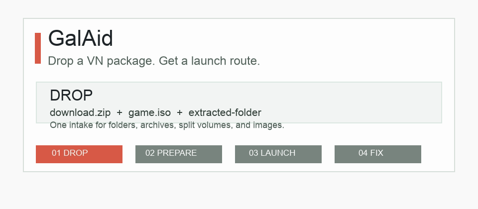

# GalAid

[English](README.md) / 简体中文 / [日本語](README.ja.md)

GalAid 是一个本地优先的视觉小说 / galgame 启动诊断工具。

它想解决一个很常见的问题：游戏下载好了，却不知道该运行哪个文件，或者一启动就报错。

- 拖入游戏文件夹、压缩包或镜像文件列表
- 获取启动候选、引擎/文件结构线索、运行环境检查和下一步路线
- 导出不包含游戏文件的元数据求助包
- 可作为静态网页、GitHub Pages 演示或本地桌面 beta 使用

演示地址：`https://TonyNa-code.github.io/GalAid/`



## 为什么做这个

很多玩家卡在游戏打开之前：

- 压缩包没有完整解压
- `.iso`、`.cue/.bin`、`.mds/.mdf` 镜像不知道怎么处理
- 日区、字体、路径编码导致乱码或闪退
- 缺少旧 DirectX、VC++、VB6、.NET、QuickTime/视频组件或 RPG Maker RTP
- 文件夹里有很多 `.exe`，不知道哪个才是主程序
- Win95/Win98/WinXP 时代的入口可能其实是 DOS、Win16、旧安装盘或普通 Win32

GalAid 会把这些情况整理成一份小白也能看懂的诊断路线。

## 主要功能

- 识别可能的启动入口：`.exe`、`.bat`、`.cmd`、`.lnk`、`index.html`
- 生成按顺序执行的下一步路线
- 生成可检查的本地启动配置和 Windows 命令提示
- 标记安装器、卸载器、补丁工具、DirectX/VC++/RPG Maker RTP 运行库修复项，避免误当主程序
- 识别分卷压缩包、古早压缩包和镜像文件，例如 `.part1.rar`、`.7z.001`、`.z01/.zip`、`.lzh/.lha`、`.iso`、`.cue/.bin`
- 识别更多古早镜像和介质组合，例如 `.mds/.mdf`、`.ccd/.img/.sub`、`.nrg`、BlindWrite、`.mdx`、`.daa`、`.uif`、`.pdi`，桌面版还能读取小型 `.cue` 文件里声明的 `.bin/.img` 轨道
- 启动页提供一站式主流程：拖入包/镜像后，必要时输入密码，再点一次主按钮即可自动准备、重扫并启动推荐入口
- 桌面扫描会读取 `.exe/.com` 头部，区分 DOS COM/MZ、Win16 NE、旧 LE/LX、Win32 和 Win64；旧 Win32 入口仍可一键启动，但会附带 XP/Win98 兼容模式、旧 DirectX 和英文短路径提示
- 识别引擎和文件结构线索，包括 KiriKiri、NScripter、Siglus、RPG Maker、Unity、TyranoScript 和商业/自研引擎结构
- 将商业/自研 galgame 常见结构作为主诊断路线：根目录 exe、同级 DLL、大封包、配置文件和正确工作目录
- 根据粘贴报错匹配本地错误配方库
- 识别报错截图，把截图中的文字自动填入报错诊断
- 启动失败后提供快速问诊树：看到什么、从哪里启动、报错能否复制，并把答案写进路线、报告和求助包
- 桌面端可检测本机 DirectX 旧组件、VC++、.NET、VB6、QuickTime/旧视频组件、RPG Maker RTP 和系统区域，帮助判断是不是电脑环境缺口
- 对大目录使用 20,000+ 文件模式，只展示关键样例但保留完整元数据诊断
- 桌面 beta 支持原生文件夹选择和递归扫描
- 桌面包/镜像预检可读取 ZIP 目录、通过内置或本机 7z 工具列出 RAR/7z/LZH/LHA/ARJ/CAB/TAR 类元数据，并把启动、安装盘和运行库修复样例单独高亮；同时识别镜像介质线索、`autorun.inf + Start.exe + data1.cab` 这类老安装盘结构和包内运行库修复项；用户点击一键启动后可本地解压、挂载/解包镜像、自动重扫并启动推荐入口；如果没有游戏主程序但有 `setup.exe/autorun.exe/.msi` 或 `autorun.inf` 指向的安装入口，则单独走安装盘入口
- 复制或下载 Markdown 报告
- 导出包含路线、启动决策、环境检查、配方命中、文件清单、`package-previews.md`/`package-previews.json`、`launch-decision.md`/`launch-decision.json` 和 `privacy-summary.md`/`privacy-summary.json` 的求助包；复制文案和求助包会把用户粘贴的本机绝对路径脱敏成 `[absolute-path]`，隐私摘要只统计脱敏次数，不保存原始路径

## 诊断语言

默认界面目前以中文为主，但诊断输出可以选择中文、English 或 日本語。这个设置会影响：

- 复制报告
- 下载报告
- 路线清单
- 求助包 README 和求助摘要

默认仓库 README 仍保持英文，方便国际开源用户快速了解项目。

## 大游戏和 10GB 压缩包

GalAid 的网页版本只读取文件名、相对路径、扩展名和大小，所以 10GB 已解压游戏目录通常没有问题。真正影响浏览器体验的是文件数量，而不是总容量。

- 20,000 个文件以下：普通元数据扫描
- 20,000+ 文件：大文件夹模式
- 50,000+ 文件：跳过完整路径排序，保持页面响应

单个 `.zip/.rar/.7z/.lzh/.lha/.arj/.cab/.tar/.tgz/.tar.gz/.iso/.cue/.bin` 可以在网页里被识别为包或镜像阶段，也包括 `.mds/.mdf`、`.ccd/.img/.sub`、`.nrg`、BlindWrite、`.mdx`、`.daa`、`.uif`、`.pdi` 这类古早镜像。桌面 beta 可以额外预检 ZIP 目录元数据、通过内置或本机 7z 工具列出 RAR/7z/LZH/LHA/ARJ/CAB/TAR 类目录元数据，也能在确认内部目录后识别自解压 `.exe` 包，并读取小型 `.cue` 文件，把其中 `FILE` 声明的 `.bin/.img` 轨道合并成同一镜像组；如果 7z 兼容工具能列出镜像目录，也会在不解包的情况下识别镜像内的启动器、安装器和运行库线索，并把 `autorun.inf + Start.exe + data1.cab` 这类老安装盘入口提前归到安装盘路线。GalAid 还会识别安装盘、补丁包、特典盘、DirectX/VC++/.NET/VB6/QuickTime/RPG Maker RTP 修复项、分卷、镜像介质角色、DOS/Win16/Win32/Win64 可执行头、旧 Win32 subsystem 版本线索，以及 DirectDraw/DirectSound/DirectInput/WinMM/VC++/VB6/.NET/QuickTime/Borland 这类旧导入线索。用户点击启动页主按钮后，GalAid 会默认在压缩包旁边创建新的 `*-prepared` 目录，必要时提示输入已知密码，然后本地解压；遇到 `.tar.gz/.tgz` 这类压缩 tar 会二段展开；遇到已识别的自解压 EXE 会先当包解开再重扫；在 Windows 上挂载 `.iso`，或尽力解包常见镜像，重扫后直接启动推荐入口。如果推荐入口是 DOS COM/MZ、Win16 NE 或 LE/LX 旧格式，GalAid 会改走 DOSBox、旧系统或虚拟机路线，而不是直接启动。如果是 Win95/Win2000/XP 时代的 Win32 入口，则仍然可以先点启动，但路线会提示失败后优先检查 XP/Win98 兼容模式、禁用全屏优化、英文短路径和旧 DirectX/运行库/视频组件。如果处理后的内容只有 `setup.exe/install.exe/autorun.exe/.msi`，或 `autorun.inf` 指向 `Start.exe/SetupJP.exe/Setup.cmd` 这类安装盘入口，GalAid 会打开安装器，并提示安装完成后把安装目录拖回来。手动的“解压并重扫”或“挂载/解包并重扫”仍然保留，适合想自己选择输出位置的用户。如果启动仍失败，也可以直接勾选现象来更新路线。

## 报错截图 OCR

很多启动弹窗不能复制文字，或者用户只会截图。GalAid 现在可以选择报错截图，将识别出的中/英/日文字填入报错框，再自动套用同一套错误配方。

桌面 beta 使用 Tesseract.js；第一次识别可能会下载语言数据到应用缓存。网页版本会优先使用浏览器自带文字检测，必要时在页面里加载 OCR 引擎。

## 本地运行

直接打开：

```text
index.html
```

或者本地启动静态服务：

```bash
python3 -m http.server 4173
```

桌面 beta：

```bash
npm install
npm start
```

## 贡献

欢迎贡献错误配方、商业/自研引擎结构样例、引擎指纹、文档和误判案例。请从 [docs/CONTRIBUTING.md](docs/CONTRIBUTING.md) 和 [docs/GOOD_FIRST_ISSUES.md](docs/GOOD_FIRST_ISSUES.md) 开始。

提交前请运行：

```bash
npm run check
npm run test:smoke
```

## 许可证

MIT. See [LICENSE](LICENSE).
